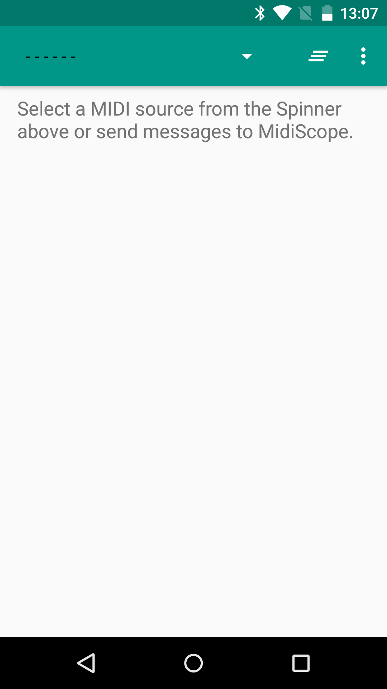
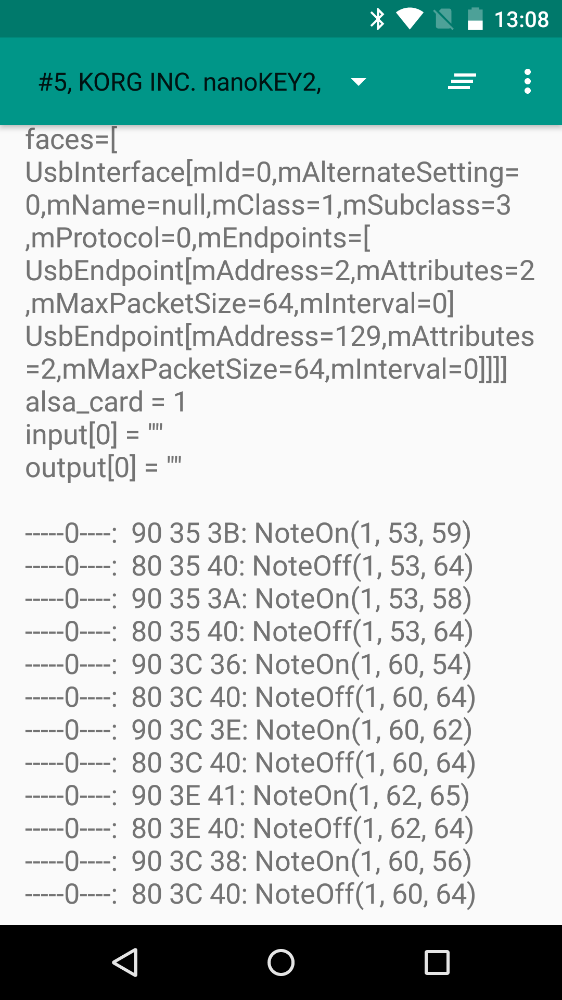

Android Arpong MIDI Arpeggiator/Visualizer
==========================================

A simple MIDI arpeggiator that takes MIDI in from an attached controller or virtual MIDI device and generates rhythmic arpeggios (in the pentatonic scale), along with a step-sequencer-style visualization.

Introduction
------------

This project makes use of the Android MIDI API ([android.media.midi][1]) to implement some basic MIDI I/O features. A scale/harmony is selected when the program starts. When a key is pressed, the program finds the nearest scale degree and starts generating a pentatonic arpeggio using a number of predefined arpeggio patterns. The generated notes are sent out as a stream of MIDI note on/off messages that can be used to trigger a synthesizer or sampler (or other MIDI instrument).

The generated arpeggiated notes are visualized on a grid of 8 steps by 16 scale degrees, similar to a piano roll (but with the concept of pitch abstracted into scale/harmony degrees). Notes that are triggered are lit up red, and collisions between multiple voices trying to play the same note (or with arpeggios that cross over the same scale degrees) are lit up blue.

Arpeggio patterns are selected based on the velocity of the input note.

The visualization UI is implemented using WebViewAPI.

This project was created during Google's 2016 MIDI Hackathon on-site at the Googleplex in Mountain View, CA.

Hackathon project members:
- Yuval Adler
- Ricardo Garcia
- Brett Gildersleeve
- Jingwei Guo
- Toshiyuki Hayashi
- Hakan Lindh

Pre-requisites
--------------

- Android SDK 24
- Android Build Tools v24.0.1
- Android Support Repository

Screenshots
-------------

  

Getting Started
---------------

This sample uses the Gradle build system. To build this project, use the
"gradlew build" command or use "Import Project" in Android Studio.

Support
-------

- Google+ Community: https://plus.google.com/communities/105153134372062985968
- Stack Overflow: http://stackoverflow.com/questions/tagged/android

Patches are encouraged, and may be submitted by forking this project and submitting a pull request through GitHub. Please see CONTRIBUTING.md for more details.

License
-------

Copyright 2016 The Android Open Source Project, Inc.

Licensed to the Apache Software Foundation (ASF) under one or more contributor
license agreements.  See the NOTICE file distributed with this work for
additional information regarding copyright ownership.  The ASF licenses this
file to you under the Apache License, Version 2.0 (the "License"); you may not
use this file except in compliance with the License.  You may obtain a copy of
the License at

http://www.apache.org/licenses/LICENSE-2.0

Unless required by applicable law or agreed to in writing, software
distributed under the License is distributed on an "AS IS" BASIS, WITHOUT
WARRANTIES OR CONDITIONS OF ANY KIND, either express or implied.  See the
License for the specific language governing permissions and limitations under
the License.
